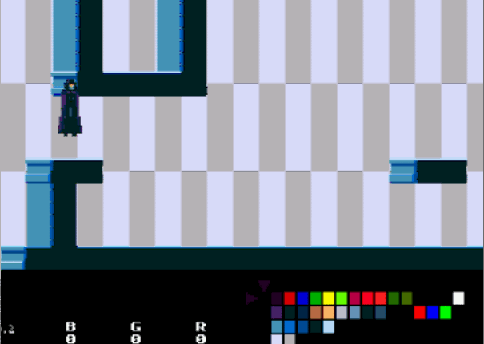

# MegaColorTweaker
A Mega Drive "game" that let's you edit the palette of your sprites and images. Uses SGDK.

The problem: creating pixel art for the Mega Drive (or indeed any retro system) is challenging. It can only render 512 colors stored in 9 bits. My editor of choice, Aseprite, does not limit the colors to what the Mega Drive understands, so I have to make the art, load it into the game (using SGDK's rescomp tool which approximates the colors), see if it looks half decent, it usually does not, repeat. I tried every image editor out there and could not find a simpler workflow to tweak the colors of my art. I tried picking colors from an image containing all legal colors but that's a poor workflow.

The solution: I made a small mega drive game that allows you to edit the color palettes and see the result on the sprites and tiles on screen. You can load your own sprites and backgrounds, build the rom and play it. The RGB coordinates are also shown on-screen and have been scaled to match Aseprite's 256 normalization factor. Then you write it down the colors you like. Yeah, that part sucks, but it's the best I can do until a better pixel art editor steps up.

I like to reserve PAL0 for the interface objects, like font and those tiny arrows. But you do whatever you want. And you adjust the colors by using ABCXYZ to change the RGB components of the color. A lowers blue, X increases blue, B lowers green etc...

Also, I'm uploading my working directory as is, with VSCode crap and my bat file that runs the emulator. I recommend pulling the src, inc, and res folders into your own work environment.

